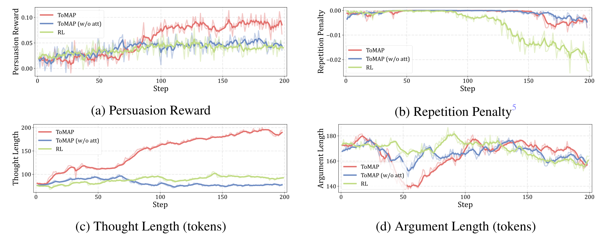
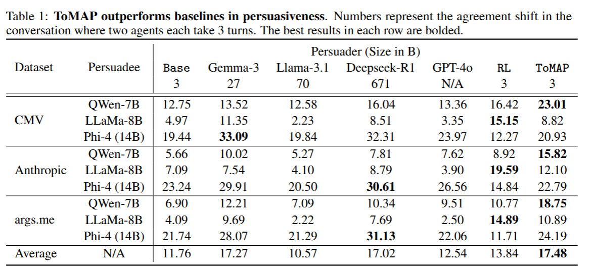

<div align="center">
<h1>
ToMAP: Training Opponent-Aware LLM Persuaders with Theory of Mind
</h1>
</div>

<div align="center">
<h3>
Peixuan Han, Zijia Liu, Jiaxuan You
</h3>
</div>


<p align="center">
<a href="xxx" target="_blank">📃TODO</a> • <a href="xxx" target="_blank">🤗TODO</a>
</p>


# About


Theory of Mind Augmented Persuader (**ToMAP**) is a novel persuader training schema that incorporates theory of mind information, enabling the model to analyse the opponent's current thoughts, and develop more effective, targeted persuasion strategy. ToMAP enables language models of 3B size to obtain impressive persuasion capability, outperforming much larger LLMs.


# Repo Structure

### Persuasion Setup
Refer to `verl/env_feedback/argument_graph.py`.

### RL Workflow
Refer to `verl/trainer/main_ppo.py` and `verl/trainer/ppo/ray_trainer.py`.
The original single-turn rollout is replaced by the multi-turn rollout in `verl/llm_agent/generation.py`.
The implementation is pretty slow and there are definitely rooms for improvement. Any suggestions welcomed.

### Reward Design
Refer to `verl/utils/rewards.py` and `verl/trainer/main_ppo.py RewardManager`.

### Hparams
Refer to `verl/trainer/config/ppo_trainer.yaml`.

Specially, you should always set `trainer.is_debate=True` when running persuasion tasks.

# Preperation

Steps with **\*** are necessary. Other steps are preprocess by us, only required if you wanna reproduce from scratch.

### Install Dependencies*

+ `python=3.9` and `vllm==0.6.3` is required for this repo.
+ It's recommended to use pip package manager. Run the following commands to install all requirements:
```
pip install -r requirements.txt
pip install flash-attn --no-build-isolation
pip install -e . # verl
```
+ Also, **remember to set the system variables according to your environment before using any of the bash scripts below, which are marked with "###"**.

### Load the Persuadee*

We use vllm to deploy the persuadee (by default Qwen2.5-7B-Instruct): `scripts/load_server.sh`.

For the attitude predictor, an BGE-M3 encoder should also be deployed (which is small so won't take much GPU memory): `scripts/load_encoder_server.sh`. This requires **vllm >= 0.8.4**, so you may need another environment to deploy it.

**When you are running later experiments, make sure to have the API serve working.** Otherwise, you won't get the real error message from ray, what you'll get is probably `RuntimeError: Failed to unpickle serialized exception`.

You can choose the port number. By default it's 1279 for QWen-7B, 1568 for LLaMa-8B, 2184 for Phi-4 and 1450 for BGE-M3.

We support `external_persuadee` but the interface is inconvenient currently.


### Prepare Data
First you should have a list of topics named `statements.json`, which is formated as:
```
{
    "Topic 1",
    "Topic 2",
    ...
}
```
Use the following scripts to obtain claims for both sides in the debate.

```
python data_gen/process_debate_datasets.py --base_dir [BASE_DIR]
python data_gen/debate.py --base_dir [BASE_DIR]
```
We also release the preprocessed data in `data`.

### Obtain Counterclaims
We found the training process doesn't affect the persuader's prediction of counterclaims, so we preprocessed all counterclaims for efficiency consideration. 

We released the preprocessed counterclaims in `data`. We collect 10 counterclaims each topic, but we only use 3 during training/evaluation.

### Obtain Initial Attitudes

We collect the persuadees' initial attitudes for efficiency consideration. To do so, run `scripts/build_tree.sh`.

You can also skip this step, and the training/evaluation script will do that.

We released the attitudes for three persuadees in the main experiment in `data`.


### Train the Attitude Predictor
+ Use `scripts/train_predictor.sh` to train the attitude predictor.

+ We released the checkpoint [here](https://huggingface.co/HakHan/ToMAP-Predictor).


# Persuader Training

Please refer to `scripts/train.sh`.

Specially, `tom_style` and `max_width` are key hyperparameters affecting **theory of mind setting**:
+ For ToMAP, set `tom_style=black_external` and `max_width=3`, which means 3 counterclaims are generated, and an external attitude predictor is used to predict the persuadee's attitude.

+ For base model, set `tom_style=black_skip` and `max_width=0`. 

+ `tom_style=black_skip` and `max_width=3` is the ablation setting "ToMAP (w/o att)", which means 3 counterclaims are generated, but no predictions about persuadee attitude is provided.

+ There are other tom_styles for ablations. Notably, `tom_style=white` refers to collecting the persuadee's real attitude.

If you want to customize other hyperparameters, you can refer to `verl/trainer/config/ppo_trainer.yaml` for details.

### Training Plots




## Evaluation
Please refer to `scripts/validate.sh`.

The script enables serialized evaluation over multiple tasks, multiple persuadees and multiple persuaders.


**Since the CMV and args.me corpus are large, we only use 20% of CMV validate data, and 50% of arge.me validate data.** The data statistics reported in the paper are after truncation.

Each entry of the validation result is saved in the following format:
```
"pos": "Pizza should contain pineapple.",
"neg": "Pizza should not contain pineapple.",
"turns": [
    "...(by Alice)",
    "...(by Bob)",
    ...
    ],
"thoughts": [
    "...(by Alice)",
    "...(by Bob)",
    ...
    ],
"reward": xxx
```

### Eval Results



## Cite this paper
This repo is based on [TinyZero](https://github.com/Jiayi-Pan/TinyZero). We removed unrelated parts from the original repo.


If you find this repo or the paper useful, please cite:
```
TODO
```

Reach out to [Peixuan Han](mailto:ph16@illinois.edu) for any questions.
